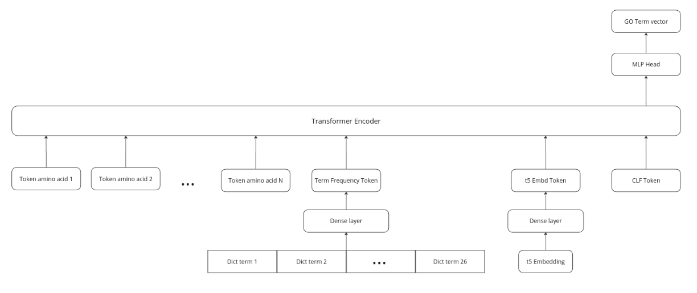

# CAFA 5 protein function Prediction with TensorFlow

## Description
This repository contains notebooks that outline the proposed solutions for the **Kaggle** competition focused on predicting protein functions (https://www.kaggle.com/competitions/cafa-5-protein-function-prediction/overview). The primary objective of this project is to develop models capable of predicting the biological function of proteins using their amino-acid sequences and additional data. This work helps researchers better understand the function of proteins, contributing to advancements in drug discovery and therapies for various diseases.

## Context
Proteins are vital for a wide range of activities in tissues, organs, and cells. They are large molecules composed of amino acids, and the sequence of these amino acids determines the protein's structure, dynamics, and biological function. Genome sequencing projects have generated extensive data on amino-acid sequences from thousands of species. Understanding the function of these proteins is crucial to molecular biology, medicine, and health sciences.

## Dataset Description
The dataset used in this competition contains protein sequences, their associated annotations (Gene Ontology terms), taxonomic information, and more. Annotations for proteins serve as ground truth labels based on experimentally validated data. Key components of the dataset include:

- Protein sequences in FASTA format.
- Annotations of Gene Ontology terms indicating protein function.
- Taxonomy data linking proteins to species.
- A test set for which predictions are required.

Additionally ems2 protein embeddings are required.

The following folders and files are needed to execute the notebook:

- Train
    - train_sequences.fasta - amino acid sequences for proteins in training set
    - train_terms.tsv - the training set of proteins and corresponding annotated GO terms
    - train_taxonomy.tsv - taxon ID for proteins in training set
    - go-basic.obo - ontology graph structure

- Test
    - testsuperset.fasta - amino acid sequences for proteins on which the predictions should be made
    - testsuperset-taxon-list.tsv - taxon ID for proteins in test superset (Note: you may need to use encoding="ISO-8859-1" to read this file in pandas)

- ems2
    - train_embeddings.npy
    - train_ids.npy
    - test_embeddings.npy
    - test_ids.npy

IA.txt - Information Accretion for each term. This is used to weight precision and recall.

## Data loading and processing

Creating the labels for the model is key. I developed an algorithm that exploits the information on the importance of each label. Not all labels/terms have the same weight. Some are more important than others. While some labels are weighted with 0.5 or 0, some weigh 7 (this importance is used to assess performance, and you can see it in the IA.txt file). The algorithm retrieves the M most frequent terms and then filter those terms by a cutoff number. Anything with a weight lower than the cutoff is not taken into account.

At first, I tried to take only terms with high weight values, but the experiments demonstrated that the frequency of the term in the data was significantly more important for better performance. I ended up using a very low cutoff value (0.01) to avoid taking GO terms with zero weight. 

These are the functions used for data processing:

1. **`load_sequence(fasta_file, amino_dict, seq_length)`**:
   - **Purpose**: Loads protein sequences from a FASTA file, converts them to numerical representations using a dictionary that maps amino acids to numerical values, truncates or pads the sequences to a specified length, and computes term frequency embeddings for the sequences.
   - **Process**:
     - Parses the FASTA file, extracts sequence IDs, original sequences, and lengths.
     - For each sequence, truncates or pads to the specified length while converting amino acids to numerical values using a provided dictionary.
     - Computes term frequency embeddings (counts of amino acids) and stores them for each sequence.
     - Returns the vectorized (numerical) sequences, sequence IDs, original sequences, their lengths, and term frequency embeddings.

2. **`load_labels(tsv_term_file, score_text_file, list_ids, num_labels_f, min_score)`**:
   - **Purpose**: Loads protein labels from a TSV file and filters them based on frequency and a score threshold.
   - **Process**:
     - Loads the list of most frequent terms from a TSV file and scores from a text file.
     - Filters the terms based on a minimum score threshold and selects only those terms that appear in both the most frequent terms and the score file.
     - Creates a label matrix where each protein sequence is assigned a 1 or 0 depending on whether it has the corresponding GO term.
     - Returns the label matrix and the final list of terms.

3. **`load_protein_embd(embd_file, ids_file, del_duplicate=False)`**:
   - **Purpose**: Loads protein embeddings and their corresponding IDs from files and sorts them. Optionally deletes a duplicate entry.
   - **Process**:
     - Loads embeddings and IDs from the specified files.
     - Sorts the embeddings and IDs by the sequence IDs.
     - Optionally removes a duplicate entry at index 632 (if instructed).
     - Returns the sorted IDs and embeddings.

These functions help in handling sequence data, generating embeddings, and loading labels for the protein prediction model.

## Model Architecture

This diagram represents a Transformer-based model architecture tailored for predicting Gene Ontology (GO) term vectors for protein sequences. Here’s a detailed explanation of the components and flow:

**Transformer tokens:**

- Token amino acid 1, Token amino acid 2, ... Token amino acid N: These tokens represent the sequence of amino acids in a protein. Each amino acid in the sequence is converted into a token, and the entire sequence is passed into the transformer encoder. These tokens are the input representing the primary structure of the protein.

- Term Frequency (TF) Token: This token represents the term frequency vector, which is passed through a dense layer before being fed into the transformer. The term frequency vector encodes information about the occurrence of specific features or terms in the protein sequence, helping the model understand the significance of certain elements in the sequence.

- t5 Embedding (or other) token: The t5 embedding is a pre-trained embedding representing the protein based on the t5 model. This embedding encodes the protein’s features into a dense representation that captures important biological information. It is passed through a dense layer and then converted into a t5 Embd Token.

- CLF Token (Classification Token): This token is typically used to indicate the classification task. The transformer uses the information from this token to perform predictions (in this case, to classify GO terms). It acts as an overall summary of the sequence input and is used during the classification process.

**Dense Layers:**

Some tokens, such as the Term Frequency Token and the t5 Embedding, are passed through dense layers to reduce or modify their dimensions before being fed into the transformer encoder. These layers help adjust the features for more efficient integration into the transformer model.

**Transformer Encoder:**

The central component of the architecture is the Transformer Encoder. This module processes the entire sequence of inputs (amino acid tokens, term frequency tokens, t5 embeddings, and the classification token) in a parallelized manner. The transformer encoder uses self-attention mechanisms to capture dependencies between different parts of the input sequence, allowing the model to focus on different aspects of the protein sequence and its features.

**Output Layer:**

The output of the transformer encoder is passed to an MLP Head (a multi-layer perceptron), which is responsible for generating the final prediction. The final output is a GO Term Vector, which represents the predicted Gene Ontology terms for the input protein sequence. These terms describe the biological functions, processes, or cellular components associated with the protein.

### BERT Segments trick

**Three Types of Embeddings:**

For each token in the input sequence, three types of embeddings are added together to form the final input representation that is fed into the transformer encoder:

**Segment Embeddings:**

Segment embeddings help differentiate between different parts or segments of the input sequence. In this case, segment embeddings like Seg A embd, Seg B embd, etc., are used to assign different segments for different tokens such as A, z, B, TF vector, t5 embd, and CLF Token.
For instance, tokens related to the protein sequence might share the same segment embedding (e.g., Seg A embd), while other segments like term frequency or classification tokens may have their own segment embeddings (e.g., Seg B embd, Seg F embd).

**Position Embeddings:**

Position embeddings are used to indicate the position of each token in the input sequence. Even though transformers don't inherently have a sense of order, position embeddings allow the model to understand the sequential nature of the input.
For example, Pos 0 embd corresponds to the first token, Pos 1 embd for the second token, and so on. These help the model to capture relationships that depend on the order of tokens, such as understanding the structure of protein sequences.

**Token Embeddings:**

Token embeddings represent the actual content or meaning of the input tokens. For example, Token A embd represents the embedding of the first amino acid in the sequence, while Token TF embd corresponds to the term frequency token embedding. Additionally, Token t5 embd and Token CLF embd represent pre-trained embeddings (such as the t5 protein embedding) and the classification token, respectively. These embeddings capture the semantics of the input data, such as protein sequences or external embeddings like t5.

**How It Fits into the Architecture:**

The input layer is composed of various tokens (e.g., protein sequence tokens, TF vector, t5 embeddings, CLF token), which are each passed through the token embeddings.
For each token, the segment embedding, position embedding, and token embedding are added together. This results in a final vector for each token that carries information about its identity, position in the sequence, and the part of the input it belongs to. These combined embeddings (segment + position + token) are the input that is passed into the Transformer Encoder for further processing.

---
